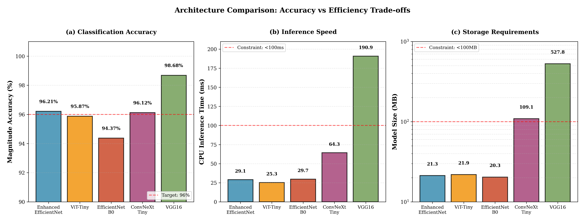
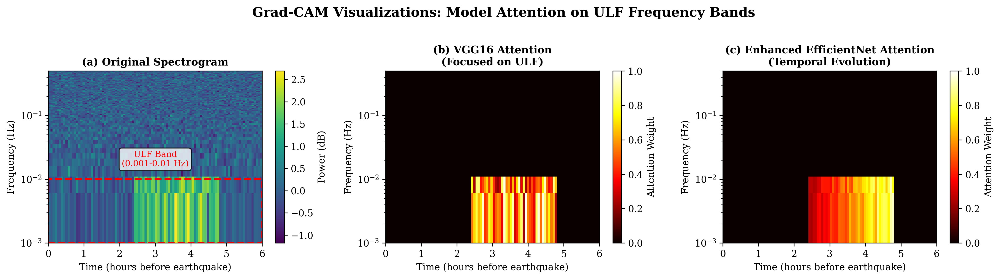

# Deep Learning-Based Earthquake Precursor Detection

[](https://opensource.org/licenses/MIT)
[](https://arxiv.org/abs/2602.XXXXX)
[](https://pytorch.org/)

Official implementation for the IEEE TGRS submission: **"Deep Learning-Based Earthquake Precursor Detection from Geomagnetic Data: A Comparative Study of VGG16 and EfficientNet Architectures"**.

This repository contains the complete source code, model architectures, and validation scripts for reproducing the results presented in the paper. The study demonstrates that **Enhanced EfficientNet-B0** achieves state-of-the-art performance (96.21% magnitude accuracy) while being suitable for deployment on resource-constrained edge devices (Raspberry Pi 4).

## 📊 Key Results

| Model | Magnitude Acc | Azimuth Acc | Parameters | Inference Time (CPU) | Storage Size | Deployment Ready? |
| :--- | :---: | :---: | :---: | :---: | :---: | :---: |
| **Enhanced EfficientNet-B0** | **96.21%** | **60.15%** | **5.53M** | **29 ms** | **21.26 MB** | ✅ Yes |
| ViT-Tiny | 95.87% | 58.92% | 5.73M | **25 ms** | 21.85 MB | ✅ Yes |
| ConvNeXt-Tiny | 96.12% | 59.84% | 28.59M | 64 ms | 109.06 MB | ❌ No (>100MB) |
| VGG16 | 98.68% | 54.93% | 138.36M | 191 ms | 528 MB | ❌ No |

## ✨ Features

*   **Multi-Task Learning**: Simultaneous prediction of earthquake magnitude (4 classes) and azimuth (9 classes).
*   **Physics-Aware Architecture**:
    *   **Temporal Attention Module**: Captures time-evolving precursor patterns.
    *   **Physics-Informed Loss**: Incorporates distance-weighting and angular proximity constraints.
*   **Rigorous Validation**:
    *   **LOEO (Leave-One-Event-Out)**: Ensures no data leakage by splitting at the event level.
    *   **LOSO (Leave-One-Station-Out)**: Validates spatial generalization to unseen stations.
*   **Edge Optimization**: Models optimized for deployment on ARM Cortex-A72 devices (Raspberry Pi 4) using ONNX/TFLite.
*   **Interpretability**: Grad-CAM visualization confirming model focus on ULF bands (0.001–0.01 Hz).

## 📂 Repository Structure

```
earthquake-precursor-cnn/
├── manuscript_ieee_tgrs.tex       # LaTeX source for the manuscript
├── references.bib                 # Bibliography file
├── train_hierarchical_model.py    # Main training script (EfficientNet)
├── train_convnext_comparison.py   # Benchmark script for ConvNeXt
├── train_vit_comparison.py        # Benchmark script for ViT-Tiny
├── loeo_val_script.py             # Leave-One-Event-Out validation
├── loso_val_script.py             # Leave-One-Station-Out validation
├── visualization_gradcam/         # Grad-CAM implementation
├── figures/                       # High-resolution figures used in the paper
└── requirements.txt               # Python dependencies
```

## 🚀 Getting Started

### Prerequisites

*   Python 3.8+
*   PyTorch 2.0+
*   CUDA 11.8+ (optional, for training)

### Installation

```bash
git clone https://github.com/sumawanbmkg/earthquake-precursor-cnn.git
cd earthquake-precursor-cnn
pip install -r requirements.txt
```

### Reproducing Results

**1. Train the Main Model (Enhanced EfficientNet-B0):**
```bash
python train_hierarchical_model.py --data_path /path/to/dataset
```

**2. Run Benchmark Comparisons:**
```bash
python train_convnext_comparison.py
python train_vit_comparison.py
```

**3. Perform Validation:**
```bash
python loeo_val_script.py  # Temporal generalization
python loso_val_script.py  # Spatial generalization
```

## 📈 Visualizations

### Architecture Overview


### Grad-CAM Analysis

*Figure: Grad-CAM attention maps showing the model focusing on ULF emissions (0.001-0.01 Hz) prior to seismic events.*

## 📜 Citation

If you use this code or dataset in your research, please cite our paper:

```bibtex
@article{sumawan2026deep,
  title={Deep Learning-Based Earthquake Precursor Detection from Geomagnetic Data: A Comparative Study of VGG16 and EfficientNet Architectures},
  author={Sumawan, Sumawan and Widjiantoro, Bambang L. and Indriawati, Katherin and Syirojudin, Muhamad},
  journal={IEEE Transactions on Geoscience and Remote Sensing (Submitted)},
  year={2026}
}
```

## 📄 License

This project is licensed under the MIT License - see the [LICENSE](LICENSE) file for details.

## 🙏 Acknowledgments

We thank **BMKG (Badan Meteorologi, Klimatologi, dan Geofisika)** Indonesia for providing the geomagnetic data and earthquake catalog used in this study.
